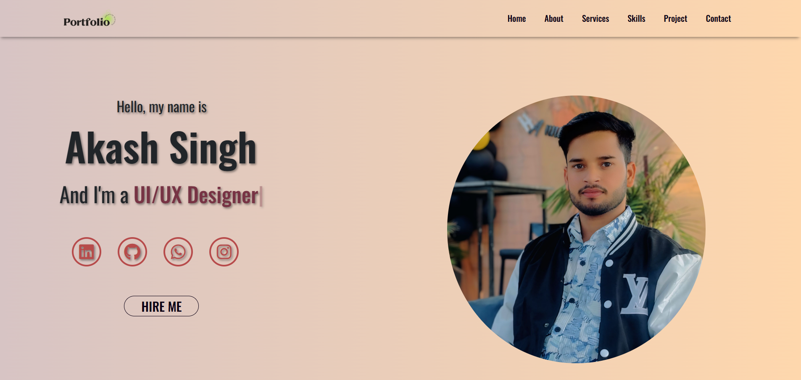
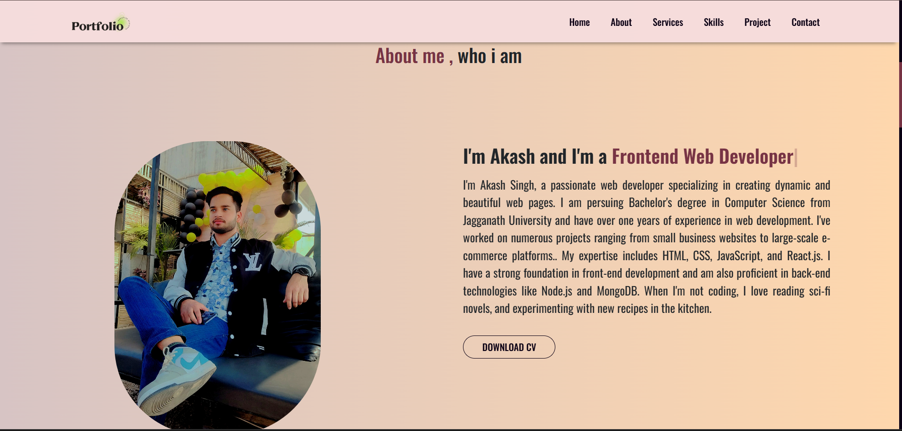

📝 Project Description

My Portfolio Website is a personal web project created to showcase my skills, achievements, and projects. It is built using HTML, CSS, JavaScript, and Bootstrap, focusing on clean design, smooth navigation, and responsive layouts for all devices. The website highlights my journey as a B.Tech Computer Science student and my expertise in web development, UI/UX design, and data analysis. It includes dedicated sections for my profile, technical skills, projects and contact information. The goal of this portfolio is to present my professional identity online and provide recruiters, collaborators, and visitors an engaging way to explore my work, experience, and passion for building modern, user-friendly web applications.

  

Live Website: https://akash8955.github.io/myPortfolio/

<b></b>
  <b>
    
About Page

    

  

  </b>
    
  <b>
  
Project Page  :

   

  

 
  </b>
  <b>
    
  </b>
  

  

<b>⚙️ Installation & Setup (Local) </b>
# Clone the repo 
git clone https://akash8955.github.io/myPortfolio/ 

# Go to project folder 
cd myPortfolio 

To view full Portfolio website go to link and Contact me for collaboration

